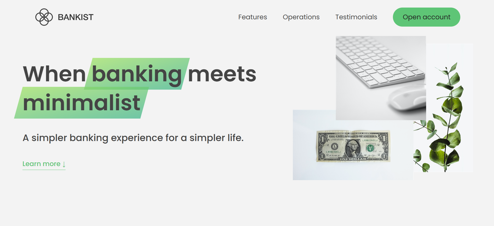
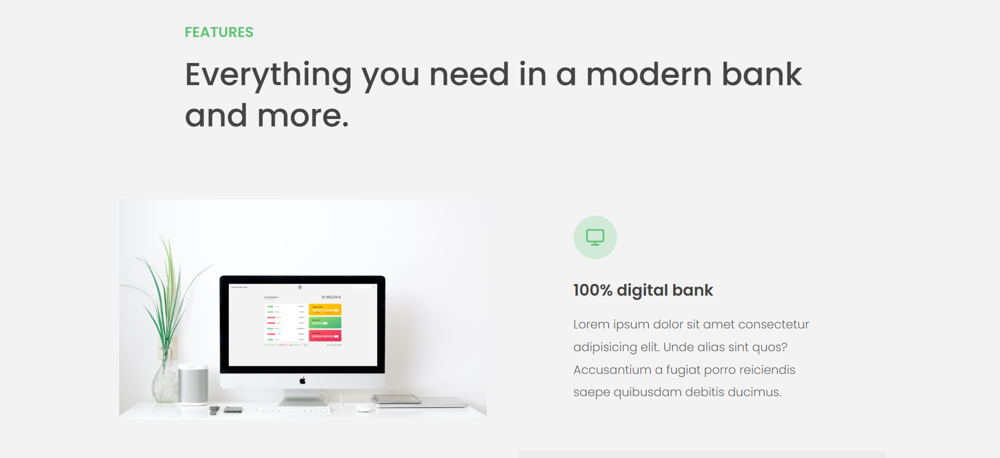
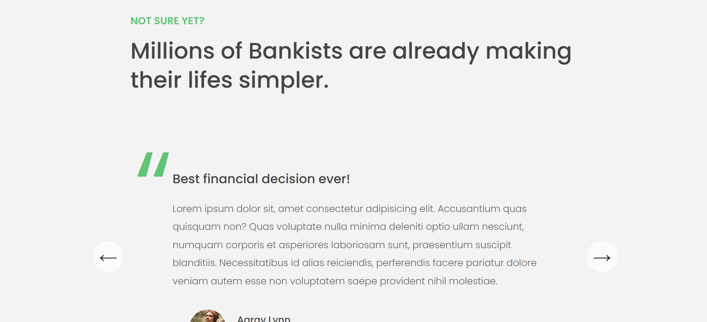

# 🏦 Bankist Landing Page – High-Converting Marketing Website (Frontend)

Welcome to the **Bankist Landing Page**, a sleek, responsive marketing website designed to promote the fictional digital bank "Bankist". This project is the **marketing companion** to the [Bankist Web Application](https://miftahulxarfeen.github.io/Bankist-app/), and it demonstrates how modern frontend techniques can bring a brand to life — with compelling visuals, smart interactivity, and smooth animations, all built using **HTML5, CSS3, and vanilla JavaScript (ES6+).**

---

## 🔗 Live Demo

👉 [Visit Live Site](https://miftahulxarfeen.github.io/Bankist-website/)  
📁 [Explore the Bankist Web App (Client Dashboard)](https://miftahulxarfeen.github.io/Bankist-app/)

---

## 🚀 Key Highlights

- 🧭 **Sticky Navigation Bar** that responds to scrolling
- 🪄 **Smooth Scrolling** and intuitive link behavior
- 🖼️ **Lazy Loading Images** for performance optimization
- 🧩 **Tabbed Components** to showcase services and features
- ✨ **Section Reveal Effects** as you scroll through the page
- 🎯 **Fully Functional Testimonial Slider** with dot navigation
- 📦 **Modular JavaScript** for clean, maintainable code
- 🎬 **Modal Windows** with open/close logic using `EventListener`
- 🧪 **Built with accessibility and UX principles in mind**

---

## 🧠 What I Practiced and Learned

- DOM event delegation for efficient interactivity
- Scroll-based animations and `IntersectionObserver` API
- DRY JavaScript through reusable component logic
- Best practices for modular, readable JS architecture
- Enhancing performance using lazy loading and script deferring
- How to structure a **conversion-focused landing page**

---

## 🛠️ Tech Stack

| Technology | Purpose |
|------------|---------|
| **HTML5** | Semantic, SEO-friendly structure |
| **CSS3**  | Responsive layout with Flexbox & Grid |
| **JavaScript (ES6+)** | Interactivity, animations, and modular code |
| `IntersectionObserver` API | Scroll-based section reveals |
| `forEach`, `querySelectorAll`, `closest`, etc. | DOM manipulation |

---

## 📁 Project Structure

Bankist-website/
├── index.html # Main HTML structure
├── style.css # Full styling including responsiveness & animations
├── script.js # Core JS logic: nav, scroll, slider, tabs, modal
├── /img/ # Optimized image assets
├── /screenshots/ # Screenshots for documentation
└── README.md # This file

---

## ✨ Screenshots

| Hero Section | Features Section | Slider Component |
|--------------|------------------|------------------|
|  |  |  |

---

## 🙋 About the Project

This landing page was inspired by real-world banking websites and designed to **showcase frontend UI/UX mastery** without any frameworks. From a sticky navbar to a testimonial slider, every component is handcrafted in vanilla JavaScript, emphasizing performance, code clarity, and delightful user experience.

🕒 Built over a focused development period during my journey as a frontend developer.

---

## 👤 Author

**Miftahul Arfeen**  
💻 Frontend Developer | Passionate Learner | Clean Code Advocate  
📬 [LinkedIn](https://www.linkedin.com/) | 🌐 [Portfolio](https://miftahulxarfeen.github.io/Personal-portfolio/) | 💼 [GitHub](https://github.com/miftahulxarfeen)

---

## ⭐ Final Thoughts

The **Bankist Landing Page** is more than just a static site — it’s a performance-optimized, interactive, and visually rich frontend build. Whether you're here to explore the code, get inspired, or learn techniques — thank you for checking it out!

If you like this project, a ⭐ on the repo would mean a lot!

---

## 📜 License

This project is open-source and available under the [MIT License](LICENSE).
